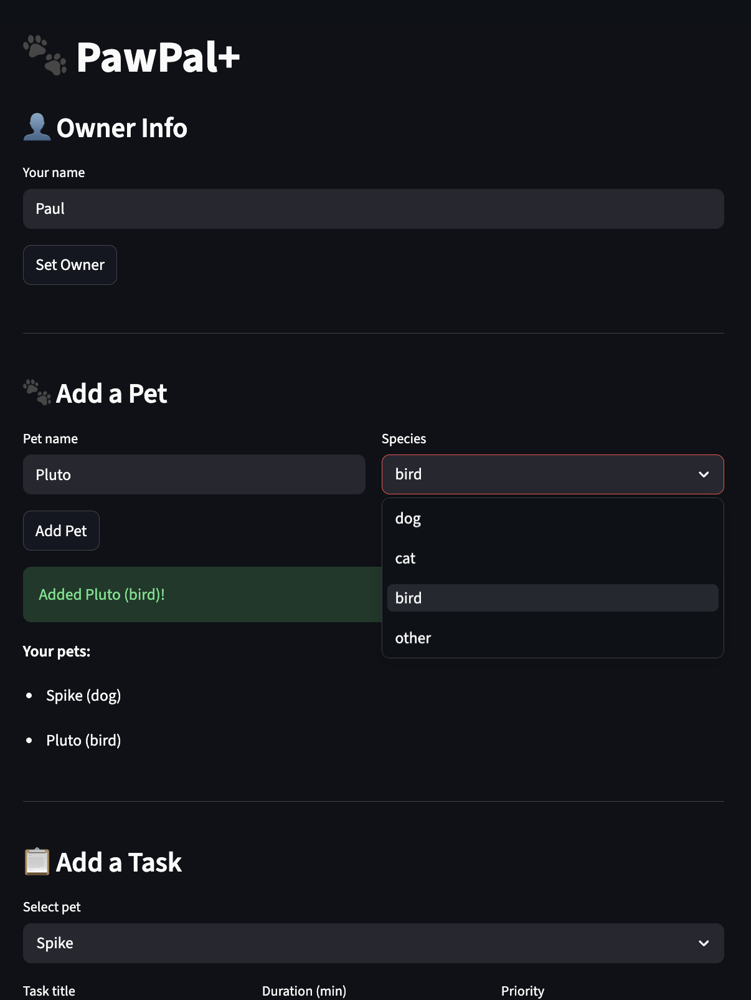
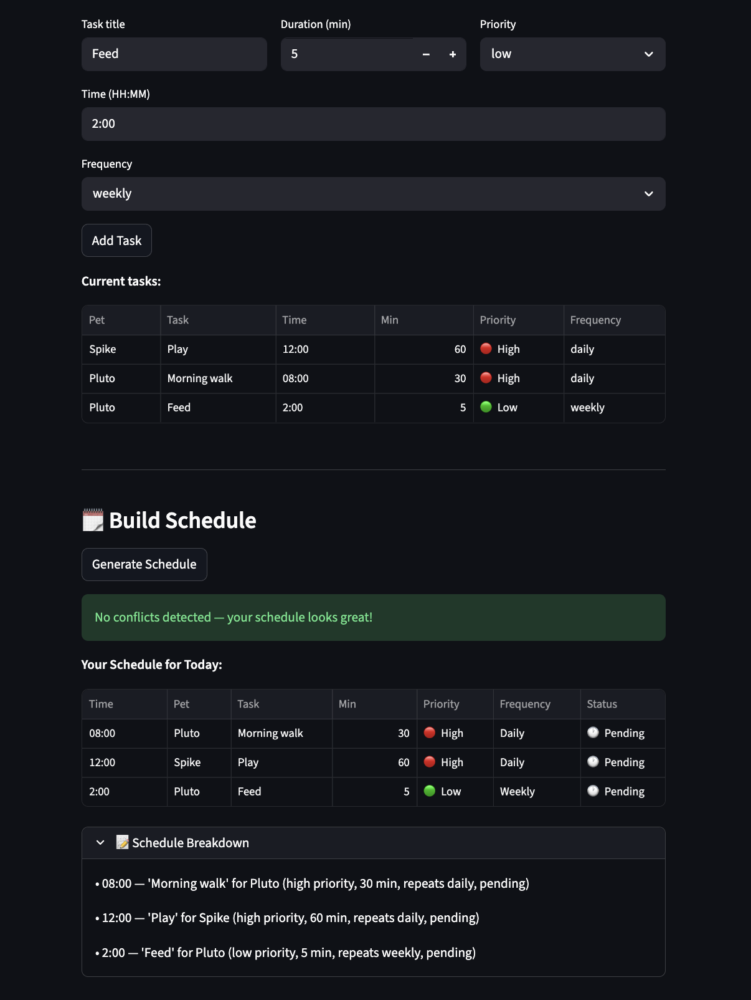
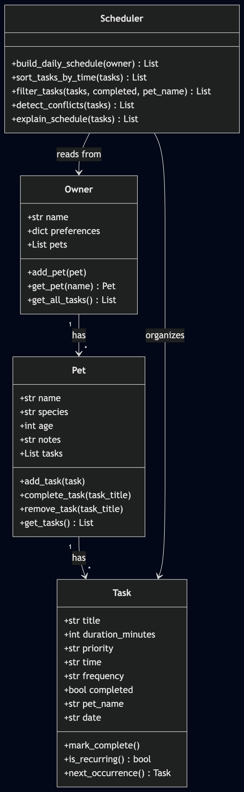
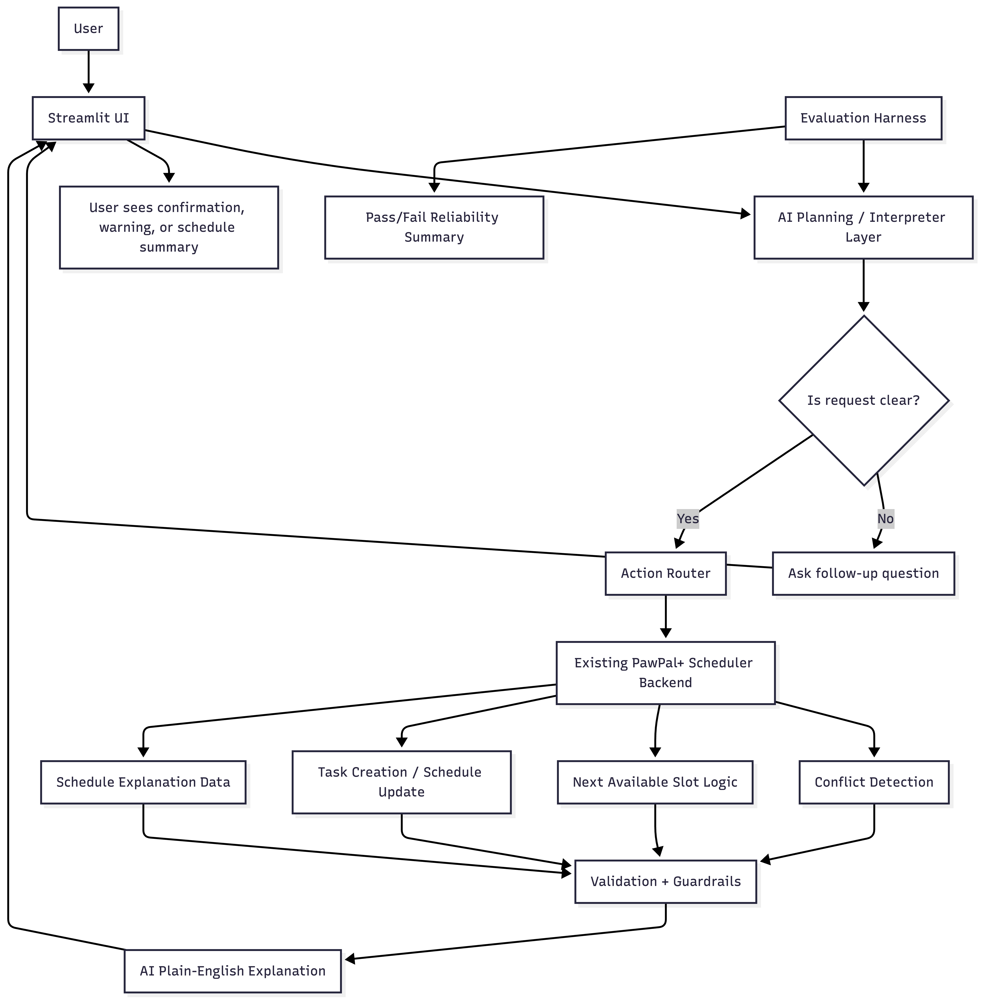

# Paw AI Planner

Paw AI Planner is an AI-assisted pet care scheduling system built on top of the original PawPal+ project. Users can describe tasks in plain English, and the system converts requests into structured scheduling actions, detects conflicts, suggests better times, and explains daily plans clearly.

## Original Project: PawPal+

The original PawPal+ project was a rule-based Streamlit scheduler for pet owners. It allowed users to add pets and tasks, sort schedules by time and priority, detect conflicts, and manage recurring care routines. However, users had to manually enter structured task data rather than using natural-language requests.

This is explicitly required by the rubric.

## Features

- Add an owner profile and multiple pets
- Create tasks with a title, time, duration, priority, and recurrence (once / daily / weekly)
- Generate a daily schedule sorted by time, with priority tie-breaking
- Detect and display conflicts when two tasks overlap
- Recurring tasks automatically queue their next occurrence when completed
- Plain-English schedule breakdown so the plan is easy to read
- Finds the next open time slot in the day for a new task of any duration, automatically skipping over busy blocks
- Returns `None` if no gap fits before the end of the day (18:00), so you always get a clear answer
- Priority shown with color-coded emoji labels (🔴 High, 🟡 Medium, 🟢 Low) in both the task list and schedule
- Task and schedule tables use a clean dataframe layout with compact columns for Time, Duration, and Status
- Conflict warnings stand out with highlighted `st.warning` blocks
- Schedule breakdown is tucked into a collapsible section to keep the page uncluttered
- CLI output shows priority labels and `✓`/`·` status symbols so printed schedules are easier to scan
- Add tasks from natural language
- Detect scheduling conflicts
- Suggest better available times
- Ask clarification questions for vague requests
- Explain daily schedule in plain English
- Existing deterministic scheduler ensures reliable outputs

## Functionality 1: Natural-Language Task Creation

**Status:** Implemented and tested (55 passing tests)

Users can now describe pet care tasks in plain English instead of filling out structured forms. The system parses requests, extracts required information (pet name, task title, time), and creates tasks automatically.

### Supported inputs

```
"Walk Mochi at 9 AM"
"Give Luna medicine at 8 PM"
"Schedule feeding for Max at 7 AM with high priority"
"Groom Mochi at 2 PM for 20 minutes daily"
"Give Mochi medication at 20:00 for 5 minutes, urgent"
```

### Clarification behavior

If required information is missing, the system returns a friendly clarification message instead of creating a task:

```
User: "Walk Mochi for 30 minutes"
System: "I understood: pet=Mochi, task=Walk, duration=30min
         I need: time (HH:MM format)
         Example: 'Walk Mochi at 9 AM for 30 minutes, high priority'"
```

Missing fields are validated strictly: **pet name, task title, and time are required**. Duration, priority, and frequency use safe defaults (30 min, medium, once).

**Pet name matching:** Pet names are matched as complete words (word-boundary matching, case-insensitive). For example, the pet name "Luna" will match requests like "walk Luna at 9 AM" or "walk luna at 9 AM", but will NOT match "Lunar eclipse" or other text where "Luna" is part of a larger word.

### Current limitations

- ⏸️ **Task editing via NL** — Natural-language parsing is for creation only; editing uses the structured form.
- ⏸️ **Multiple pets in one request** — If multiple pet names are mentioned, the first match wins. For multi-pet tasks, use separate requests or the structured form.

These features are part of future Functionality phases.

## Functionality 2: Conflict Detection

**Status:** Implemented and tested (7 additional tests, 62 total passing)

Natural-language task creation now checks for scheduling conflicts before adding tasks. When a user describes a task in plain English, the system parses the request and compares the new task against all existing tasks to detect time overlaps.

### Conflict behavior

If a conflict is detected:
- The system shows warning messages describing each conflict
- The parsed task details are displayed for review
- The task is NOT automatically added to the schedule
- The user must modify their request (typically changing the time) and try again

If no conflict exists:
- The task is added normally as before

### Example

```
User: "Walk Mochi at 9:15 for 20 minutes"
System: "Schedule conflict detected:
         Conflict: 'Morning Walk' (Mochi, 09:00, 30 min) overlaps 'Walk' (Mochi, 09:15, 20 min)
         
         Task: Walk for Mochi at 09:15 (20 min, medium priority, once)
         The next available slot is at 09:30.
         Please try a different time and submit again."
```

## Functionality 3: Suggest Better Available Times

**Status:** Implemented and tested (11 additional tests, 73 total passing)

When a natural-language task request creates a conflict, the system now automatically suggests the next available time slot when one exists. This helps users quickly find alternative times without manual trial-and-error.

### Suggestion behavior

If a conflict is detected:
- The system shows warning messages describing each conflict (as before)
- The parsed task details are displayed for review (as before)
- The task is NOT added to the schedule (as before)
- **NEW**: If a valid time slot exists later in the day, the system suggests it automatically
- **NEW**: If no slot is available, the system clearly states "No available slots found for the rest of the day."
- The user can then submit a new request with a different time, use the suggested time, or modify their approach

The system remains under user control: no tasks are automatically moved or added.

### How suggestions work

Suggestions reuse the existing scheduler availability logic (`find_next_available_slot`) to ensure they respect:
- The requested task duration
- All existing tasks for all pets (cross-pet awareness)
- The working day window (08:00 to 18:00)
- Back-to-back task rules (tasks can touch but not overlap)

### Example

```
User: "Schedule a grooming appointment for Max at 5 PM."
System: "Schedule conflict detected:
         Conflict: 'Max feeding' (Max, 17:00, 30 min) overlaps with new task
         
         Task: Grooming for Max at 17:00 (30 min, medium priority, once)
         The next available slot is at 17:30.
         Please try a different time and submit again."
```

If the day is full:

```
User: "Add an urgent task for Mochi at 8 AM for 1 hour."
System: "Schedule conflict detected:
         Conflict: 'Morning walk' (Mochi, 08:00, 30 min) overlaps with new task
         
         Task: Urgent task for Mochi at 08:00 (60 min, high priority, once)
         No available slots found for the rest of the day.
         Please try a different time or adjust existing tasks."
```

## Functionality 4: Plain-English Schedule Explanation

**Status:** Implemented and tested (21 additional tests, 106 total passing)

Users can now ask for a plain-English explanation of their daily pet care schedule. The system distinguishes between task-creation requests and schedule-explanation requests, providing clear summaries of existing schedules.

### Explanation behavior

Schedule explanation requests are automatically detected and handled separately from task creation:

- **Request classification**: Uses keyword matching to identify explanation requests (e.g., "explain", "what's", "summarize", "tell me") combined with time scope words (e.g., "today", "day", "schedule", "plan")
- **Separate from task creation**: `parse_request()` remains focused on Functionality 1-3; explanation uses a dedicated `explain_schedule()` method
- **Uses existing scheduler**: Leverages the same `Scheduler.build_daily_schedule()` logic for consistent ordering

### Supported explanation requests

```
"Explain today's schedule"
"What's my schedule today?"
"What does my pet care plan look like today?"
"Summarize the day"
"Tell me about today's schedule"
```

### Explanation content

The plain-English explanation includes:

- **Task order**: Tasks listed in chronological order using existing scheduler logic
- **Pet names**: Each task shows which pet it's for
- **Task details**: Title, time, duration, priority level
- **Completion status**: Shows "done" or "pending" for each task
- **Recurrence**: Indicates "repeats daily/weekly" or "one-time"
- **Conflicts**: Includes conflict warnings when overlapping tasks exist
- **Empty schedules**: Clear message when no tasks are scheduled

### Example

```
Your schedule for today:

08:00 — Feeding (for Luna, 15 min, medium priority, one-time, pending)
09:00 — Morning Walk (for Mochi, 30 min, high priority, one-time, pending)
14:00 — Grooming (for Mochi, 45 min, low priority, one-time, pending)

Total: 3 tasks.
No conflicts detected.
```

If conflicts exist:

```
Your schedule for today:

09:00 — Walk (for Mochi, 30 min, high priority, one-time, pending)
09:15 — Feeding (for Mochi, 20 min, medium priority, one-time, pending)

Total: 2 tasks.

Conflicts detected:
  - Conflict: 'Walk' (Mochi, 09:00, 30 min) overlaps 'Feeding' (Mochi, 09:15, 20 min)
```

If no tasks:

```
No tasks scheduled for today yet. Your day is clear!
```

This completes the four planned AI assistant actions for Paw AI Planner.

## 📸 Demo

> TODO: update with new screenshots

<!-- Add a screenshot of your running app here -->
<!-- To capture one: run `streamlit run app.py`, take a screenshot, save it as `demo.png`, and replace the line below -->



## Why It Matters

Busy pet owners often know what they need done but not how to organize it efficiently. Paw AI Planner reduces friction by letting users request tasks naturally while preserving reliable scheduling logic.

## Getting started

### Setup

```bash
git clone ...
cd applied-ai-system-project
python -m venv .venv
source .venv/bin/activate  # Windows: .venv\Scripts\activate
pip install -r requirements.txt
streamlit run app.py
```

### Suggested workflow

1. Read the scenario carefully and identify requirements and edge cases.
2. Draft a UML diagram (classes, attributes, methods, relationships).
3. Convert UML into Python class stubs (no logic yet).
4. Implement scheduling logic in small increments.
5. Add tests to verify key behaviors.
6. Connect your logic to the Streamlit UI in `app.py`.
7. Refine UML so it matches what you actually built.

## Testing PawPal+

> TODO: Update with real flow.

Run the test suite with:

```bash
python -m pytest tests/
```

The tests cover:

Scheduling logic — tasks are sorted by time, and ties are broken by priority (high → medium → low)
Recurring tasks — completing a daily or weekly task automatically queues the next occurrence
Filtering & conflict detection — tasks can be filtered by pet or completion status, and overlapping time windows are flagged
Natural-language parsing — plain-English task requests are converted to structured tasks with clarification for missing information
Conflict detection during parsing — new tasks are checked against existing schedules before being added
Time slot suggestions — when conflicts occur, the system suggests the next available time slot
Request classification — distinguishes between task creation and schedule explanation requests
Schedule explanation — generates plain-English summaries of daily schedules including tasks, pets, times, priorities, and conflicts
Confidence Level: 4/5 — Core scheduling and task management behaviors are well covered. Edge cases like removing tasks and back-to-back conflict boundaries are tested too. The main gap is around the AI explanation features, which are harder to unit test.

## Smarter Scheduling

The scheduler does more than just list tasks — it organizes them in a way that makes sense for a real day:

- Tasks are sorted by time so the schedule runs in order from morning to night
- When two tasks are scheduled at the same time, the higher priority task goes first (high → medium → low)
- Priority is shown with color-coded labels in both the task list and the generated schedule (🔴 High, 🟡 Medium, 🟢 Low) so it's easy to spot at a glance
- Conflict detection checks every pair of tasks and warns you if their time windows overlap
- Recurring tasks (daily or weekly) automatically create the next occurrence when marked complete

## UML representation of code

```
classDiagram
    class Owner {
        +str name
        +dict preferences
        +List pets
        +add_pet(pet)
        +get_pet(name) Pet
        +get_all_tasks() List
    }

    class Pet {
        +str name
        +str species
        +int age
        +str notes
        +List tasks
        +add_task(task)
        +complete_task(task_title)
        +remove_task(task_title)
        +get_tasks() List
    }

    class Task {
        +str title
        +int duration_minutes
        +str priority
        +str time
        +str frequency
        +bool completed
        +str pet_name
        +str date
        +mark_complete()
        +is_recurring() bool
        +next_occurrence() Task
    }

    class Scheduler {
        +build_daily_schedule(owner) List
        +sort_tasks_by_time(tasks) List
        +filter_tasks(tasks, completed, pet_name) List
        +detect_conflicts(tasks) List
        +explain_schedule(tasks) List
    }

    Owner "1" --> "*" Pet : has
    Pet "1" --> "*" Task : has
    Scheduler --> Owner : reads from
    Scheduler --> Task : organizes
```

This is visible using [Mermaid](https://mermaid.live/) (copy & paste)


# Planning for Paw AI Planner
## Project title

Paw AI Planner

## Project description

Paw AI Planner is an AI-assisted pet care scheduling app built on top of the original PawPal+ system. It allows pet owners to describe scheduling needs in plain English, translates those requests into structured scheduling actions, uses deterministic backend logic to organize tasks and detect conflicts, and explains the resulting daily plan clearly and responsibly.

A key feature of the system is that it does not just accept commands blindly. When a request is missing important details or is too vague to act on reliably, the AI identifies the ambiguity and asks the user a follow-up question through the interface before continuing.

### Original project summary

The original PawPal+ project was a rule-based pet care scheduler that let users manage pets and tasks through structured inputs. It already supported scheduling, recurrence, priority ordering, conflict detection, and readable schedule output, but users had to enter information directly rather than describing requests naturally.

## Supported AI actions

The AI assistant will support these four natural-language actions:

1. Add a task from a natural-language request

The user can describe a pet-care task in plain English, and the AI will extract the needed details and create the task.

Example:

“Add a 30-minute walk for Luna tomorrow at 9 AM.”
“Give Mochi medicine tonight at 8.”
2. Detect scheduling conflicts

The AI can review a request or an existing schedule and identify when tasks overlap or compete for the same time.

Example:

“Does anything conflict with Luna’s medication schedule?”
“Check whether my pets have overlapping tasks this morning.”
3. Suggest a better time when a request creates a conflict

If the requested time conflicts with another task, the AI will not just reject the request. It will explain the conflict and suggest a better available time using the scheduler’s existing logic.

Example:

“Schedule a grooming appointment for Max at 5 PM.”
AI response: “5 PM conflicts with Max’s feeding task. The next open 30-minute slot is 6 PM.”
4. Explain the day’s schedule in plain English

The AI can summarize the current schedule in a readable, user-friendly format rather than showing only raw task data.

Example:

“What does my pet care schedule look like today?”
“Explain today’s plan for all my pets.”

## Clarification behavior for vague requests

If a natural-language request is too vague, the AI should identify what is missing and ask a follow-up question before taking action.

This should happen when important fields are missing or unclear, such as:

pet name
task type
time
date
duration
recurrence

Examples:

“Add a walk for tomorrow.”
Missing: which pet? what time? how long?
“Schedule medicine later.”
Missing: which pet? what time exactly?
“Put in feeding.”
Missing: which pet? when?

The UI can present the follow-up question, but the AI should decide whether the input is specific enough to continue.

This is important because it makes the system more trustworthy and avoids bad scheduling decisions.

## Unsupported actions

Paw AI Planner only supports scheduling-related pet care tasks. Medical or nutrition advice requests return a veterinarian guidance message, while unrelated requests such as weather or jokes return a general scheduling-only message.

To keep the project focused and realistic, the AI assistant will not support the following:

1. Veterinary or medical advice

The system can schedule a medication task, but it should not answer medical questions.

Examples:

“Should I increase my dog’s dosage?”
“What medicine is best for my cat’s infection?”
2. General pet care advice unrelated to scheduling

The system is a planning assistant, not a general pet-care chatbot.

Examples:

“What is the best food for a senior dog?”
“How often should I bathe a rabbit?”
3. Large-scale long-term planning beyond the app’s scope

The assistant will focus on day-level or near-term scheduling, not complex long-range planning.

Examples:

“Plan the next three months of care.”
“Create a full weekly optimization strategy for all my pets.”

## Agent workflow

The AI workflow should be simple and easy to explain.

Step 1: User submits a natural-language request

The user types a request into the Streamlit interface.

Step 2: AI interprets the request

The AI identifies:

the intent
the pet involved
the task details
time/date information
any missing or ambiguous fields
Step 3: AI checks whether the request is actionable

If the request is too vague, the AI does not continue yet. Instead, it generates a follow-up question for the user.

If the request is clear enough, it moves to the next step.

Step 4: AI selects the backend action

Depending on the request, the AI chooses one of the supported scheduler actions, such as:

add task
detect conflict
find better time
explain schedule
Step 5: Existing backend logic executes the action

The rule-based PawPal+ backend remains the source of truth for:

task creation
time sorting
recurrence handling
conflict detection
next-open-slot suggestion
Step 6: AI explains the result

The AI returns a clear response, such as:

confirmation that the task was added
warning that a conflict exists
suggestion of a better time
readable summary of the day’s schedule

## High-level architecture

The system should be organized as a layered design.

1. Streamlit UI layer

Handles:

natural-language input
follow-up clarification prompts
schedule display
warnings and confirmations
2. AI planning/interpreter layer

Handles:

intent detection
entity extraction
ambiguity detection
follow-up question generation
action selection
final plain-English explanation
3. Existing PawPal+ backend layer

Handles:

pets
tasks
scheduling
priority ordering
recurrence
conflict detection
alternative time suggestions
4. Reliability/guardrail layer

Handles:

validation of extracted fields
pet existence checks
unsupported request handling
ambiguity handling
logging of decisions and outcomes
5. Evaluation layer

Handles:

predefined test prompts
expected outcomes
simple pass/fail summary for reliability testing

## Data flow

A simple way to describe the data flow is:

User request → AI interpreter → validation / ambiguity check → scheduler action → result → AI explanation → UI output

If the request is vague, the flow becomes:

User request → AI interpreter → ambiguity detected → follow-up question shown in UI → user clarification → scheduler action

## Likely files to modify
app.py

This will likely be the main UI integration point.
You will probably add:

a natural-language input field
a way to show follow-up clarification questions
a response area for explanations, warnings, and confirmations
pawpal_system.py

You may keep most of this intact, but you might add or expose helper methods that make the AI layer easier to connect to the scheduler.

new AI-related module

You will likely want one new file for the AI layer, something like:

request interpreter
action router
explanation builder
ambiguity checker

Even if the exact name changes, this should be a separate module instead of burying everything in app.py.

tests/test_pawpal.py

You’ll likely expand testing to cover:

natural-language task creation behavior
ambiguity handling
conflict response behavior
better-time suggestion behavior
README.md

You’ll need to rewrite this around the new AI system story.

main.py

Optional, but useful if you want a simple demo outside the Streamlit UI.

## Design decisions and tradeoffs

> TODO: Clean up

- Deterministic scheduler remains source of truth
- AI interprets requests but does not directly control logic
- Clarification questions used instead of guessing

Tradeoffs:

- Narrow AI scope instead of full chatbot
- Simpler reliability over maximum flexibility

Here are good Phase 1 design decisions to state early:

1. Keep deterministic scheduling logic as the source of truth

The AI should interpret requests and explain outputs, but the existing scheduler should still make the actual scheduling decisions.

Why:
This makes the system more reliable and easier to test.

2. Keep the AI scope narrow

The assistant focuses only on pet task planning and schedule explanation.

Why:
This keeps the project realistic and easier to finish well.

3. Ask follow-up questions instead of guessing

If a request is too vague, the system should ask for clarification rather than making silent assumptions.

Why:
This improves trust and reduces scheduling errors.

4. Prefer explanations over black-box behavior

The system should tell the user why something was added, rejected, or moved.

Why:
This strengthens the “responsible AI” angle of the project.

## System Architecture

The Streamlit UI collects user requests. An AI planning layer interprets intent, checks for ambiguity, routes actions to the deterministic scheduler backend, and returns human-readable explanations. An evaluation harness tests reliability across common prompt scenarios.

flowchart TD
    A[User] --> B[Streamlit UI]
    B --> C[AI Planning / Interpreter Layer]

    C --> D{Is request clear?}
    D -- No --> E[Ask follow-up question]
    E --> B

    D -- Yes --> F[Action Router]
    F --> G[Existing PawPal+ Scheduler Backend]

    G --> H[Conflict Detection]
    G --> I[Next Available Slot Logic]
    G --> J[Task Creation / Schedule Update]
    G --> K[Schedule Explanation Data]

    H --> L[Validation + Guardrails]
    I --> L
    J --> L
    K --> L

    L --> M[AI Plain-English Explanation]
    M --> B
    B --> N[User sees confirmation, warning, or schedule summary]

    O[Evaluation Harness] --> C
    O --> P[Pass/Fail Reliability Summary]



## Sample Interactions

> TODO: Fill in examples. Very important.

Example 1

Input:
Add a 30 minute walk for Luna tomorrow at 9 AM.

Output:
Added walk for Luna at 9:00 AM tomorrow. No conflicts detected.

Example 2

Input:
Schedule grooming for Max at 5 PM.

Output:
5 PM conflicts with Max's feeding task. Suggested next available slot: 6 PM.

Example 3

Input:
Add medicine later.

Output:
I need more information. Which pet should receive medicine, and what time?


## Reflection

> TODO: update after work is done.